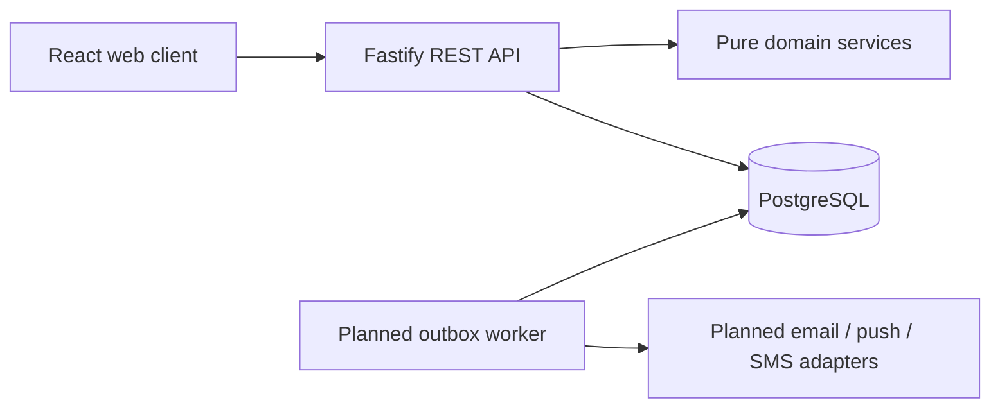

# Architecture foundation

The API serves OpenAPI-described health endpoints and configuration, security headers, narrow-origin CORS, payload limits, per-process IP limits, structured request summaries and generated request IDs. Domain modules hold calendar/scheduling/streak logic independently from transport. Shared schemas reject unknown client ownership fields. Authentication, habit, and one-time task endpoints are implemented. The current IP limiter is process-local; shared account/auth limits must precede multi-replica deployment.

Migration runner uses a PostgreSQL advisory lock, a per-migration transaction and checksums. Applied SQL cannot be edited. Ownership-bearing references use composite foreign keys. Application queries must still constrain every resource by authenticated user. Database constraints complement authorization, not replace it. Streak cache, audit metadata and mutation receipts are intended to update in the same transaction as events.

Instants use timestamptz. Calendar occurrence dates use DATE and timezone context. Effective-dated schedule rows protect past recurrence and target interpretation. Postgres DATEs must be mapped to strings in repositories, never implicitly converted to server-local Date objects. Pure domain functions accept injected local today so calculations are reproducible.

Current database model includes users/settings/sessions/reset tokens, habits/revisions/instances/freezes/streak cache, goals/temporal links/milestones, tasks/occurrences, dated reflections, notification outbox/endpoints, audit, idempotency receipts, sync changes and feature flags. SQL integrity tests cover key negative cases; complete application semantics and privacy lifecycle remain pending.

Schemas are additive refinements to the PRD: see ADR-0001 for rationale and API naming translation. Authentication uses short-lived JWTs bound to revocable session IDs and hashed rotating refresh secrets. Passwords use Argon2id. The local Docker stack serves web assets through Nginx and proxies `/api/` to Fastify on an internal network; migrations run before API startup.
