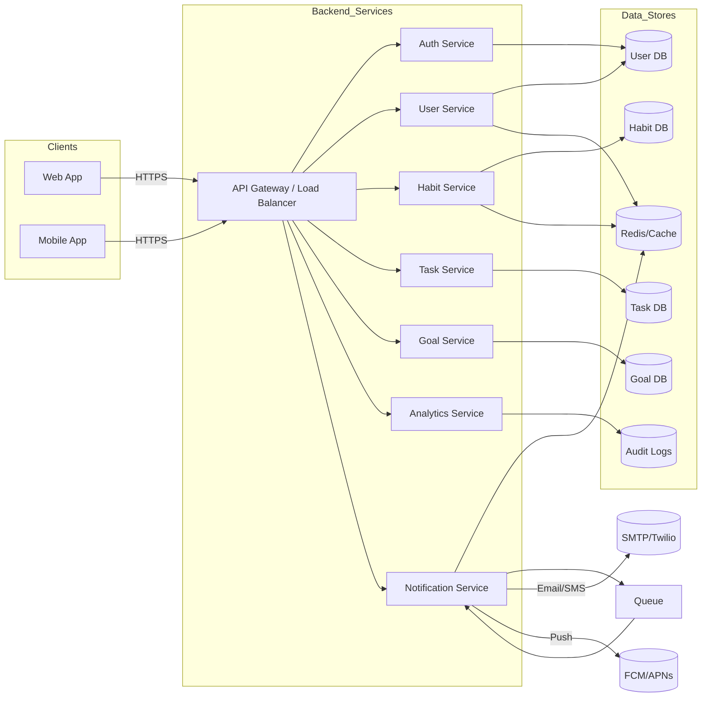
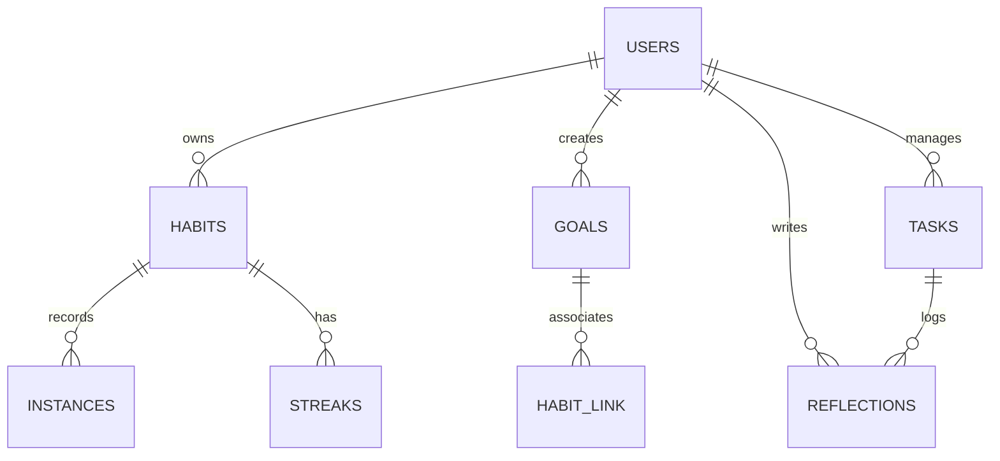

# Backend Product Requirements (Habit Tracker)

## Executive Summary  
This PRD outlines a complete backend architecture for a modern habit-tracker app. The system will expose a RESTful API (with OpenAPI docs) to web/mobile clients, managing users, habits, tasks, goals, reflections and analytics. Key priorities are clarity, security, scalability, and fast daily check-ins. Core features include habit tracking (daily logs, streak logic), goal linking, lightweight tasks, and insights. We target eventual horizontal scaling (via stateless services, caching, and partitioned data) with low-latency responses. A cloud-native, microservices-style design (e.g. API Gateway → services) with managed infrastructure (database, scheduler, messaging) ensures maintainability. Data encryption in transit (TLS) and at rest is enforced, and GDPR/PDPA compliance (user data deletion, consent) is built-in.  

The MVP focuses on core habit CRUD, daily check-ins (with skip/freeze logic), basic tasks, and analytics. Post-MVP features include advanced scheduling, richer analytics, and cross-device sync enhancements. All API endpoints, data models, auth flows, and infra components are defined below, along with tables of schemas and example payloads. Data models are normalized (Users, Habits, Instances, Goals, Tasks, etc.) with appropriate indexes and retention rules. Authentication uses JWTs with refresh tokens and optional social OAuth, with role-based admin access. We include conflict-resolution for offline/optimistic updates, and a push/notification subsystem (e.g. via FCM/APNs, Email/SMS) with retry/backoff.

## 1. Product Scope & MVP  
**Target Users:** Individuals seeking a simple, fast habit-tracking experience (e.g. wellness, productivity users). Core user goals include: defining habits, logging daily completions, viewing streaks/goals, and reflecting on progress. The app’s emotional tone is clear, calm, and encouraging – avoiding guilt (non-judgmental messages, subtle streak nudges).  

**Core Problems & Value:** Users want to build habits with minimal friction. Key values are: instant daily check-in, clarity of progress, and linking habits to larger goals. We avoid clutter and gamification; focus on information hierarchy and speed.  

**MVP Features:** 
- User account management (sign-up/in, profile, settings).  
- CRUD on Habits (name, schedule, reminders).  
- Habit completion logs (daily, weekly repeats, "skip" or recover).  
- Streak computation (current, best) with gentle recovery.  
- Tasks (daily/weekly todo, with carry-over).  
- Goals (set targets, associate habits, track progress).  
- Dashboard (today’s habits/tasks, progress bar).  
- Calendar view of habit history.  
- Basic analytics (completion rates, streak charts, heatmap).  
- Reminders (push/SMS/Email scheduling).  

**Post-MVP Enhancements:**  
- Advanced insights (trend comparisons, habit scoring).  
- Social logins (Google, Apple OAuth).  
- Rich-text reflections/journal entries.  
- More notification channels (web push, slack).  
- Multi-language support.  
- Premium features (e.g. teams or habit sharing – out of MVP scope).  

## 2. Architecture Overview  



- **API Gateway / Load Balancer:** Entry point (Cloud Load Balancer or API Gateway) routes requests to stateless services.  
- **Services:** Each domain is handled by a separate service or well-defined module (Auth, User, Habit, Task, Goal, Analytics, Notification). This **clean separation** ensures maintainability and scalability.  
- **Databases:** A primary SQL database (e.g. PostgreSQL) holds normalized tables. Redis (or Memcached) is used for caching hot data (e.g. user sessions, config) and distributed locks. A message queue (e.g. AWS SQS or Kafka) decouples jobs (reminders, emails, analytics processing). Audit logs are written to a write-optimized store (could be the same DB or an append-only store).  
- **Reminders & Notifications:** A background worker (connected to the MessageQueue) schedules and sends reminders (via AWS SES, Twilio, FCM). Horizontal scaling (multiple workers) and idempotent design ensure at-least-once delivery.  
- **Real-time updates:** WebSocket/SSE gateway can push real-time updates (for multi-device sync or collaborative features).  

This distributed design emphasizes **horizontal scaling**: services are stateless (scale via auto-scaling groups), use load balancers, and DB is scaled vertically/sharded as needed. Caching and asynchronous processing reduce latency and load. Components are deployed via IaC (Terraform/CloudFormation) in multiple availability zones for fault tolerance.

## 3. Data Model & Schema  

We use a normalized relational model. Each entity includes fields, types, indexes, and retention rules:

**Users** (accounts)  
| Field        | Type           | Null? | Description / Index                               |
|--------------|----------------|-------|----------------------------------------------------|
| `id`         | UUID PK        | No    | Primary key (UUID v4)                              |
| `email`      | VARCHAR(255)   | No    | Unique user email (login) - UNIQUE index           |
| `password_hash` | VARCHAR(255)| No    | Hashed password (bcrypt/argon2)                    |
| `name`       | VARCHAR(100)   | No    | Display name                                       |
| `timezone`   | VARCHAR(50)    | No    | IANA tz (for scheduling, default from browser)     |
| `created_at` | TIMESTAMP      | No    | Account creation time                              |
| `updated_at` | TIMESTAMP      | No    | Last profile update                                |
| `settings_id`| FK to Settings | Yes   | FK to user settings/preferences                    |

- **Indexes:** UNIQUE(email). (FKs indexed by default).  
- **Retention/GDPR:** Retain until deletion request. Upon erasure request, anonymize or delete personal fields.  

**Settings** (user preferences)  
| Field          | Type        | Null? | Description                                    |
|----------------|-------------|-------|------------------------------------------------|
| `user_id`      | UUID PK/FK  | No    | (PK) foreign key to Users                       |
| `week_start`   | INTEGER     | No    | 0=Sunday...6=Saturday (default 0)               |
| `locale`       | VARCHAR(10) | No    | e.g. `en_IN`, default from browser              |
| `dnd_start`    | TIME        | Yes   | Quiet hours start (e.g. "22:00", optional)      |
| `dnd_end`      | TIME        | Yes   | Quiet hours end (e.g. "07:00")                  |
| `notify_push`  | BOOLEAN     | No    | Push notifications enabled                      |
| `notify_email` | BOOLEAN     | No    | Email notifications enabled                     |
| `notify_sms`   | BOOLEAN     | No    | SMS notifications enabled                       |

- **One-to-One:** `user_id` is PK and FK to Users. Default values ensure usability.

**Habits**  
| Field         | Type          | Null? | Description                                        |
|---------------|---------------|-------|----------------------------------------------------|
| `id`          | SERIAL PK     | No    | Habit ID                                           |
| `user_id`     | UUID FK       | No    | Owner user (indexed)                               |
| `name`        | VARCHAR(100)  | No    | Habit name                                          |
| `description` | TEXT          | Yes   | Optional longer description                        |
| `category`    | VARCHAR(50)   | Yes   | E.g. "Health", "Productivity" (optional)           |
| `icon`        | VARCHAR(50)   | Yes   | Icon name or code (client-side asset)              |
| `color`       | VARCHAR(7)    | Yes   | Hex color for accent (optional)                    |
| `frequency`   | VARCHAR(10)   | No    | "daily"/"weekly"/"monthly"/etc. (enum)             |
| `target`      | INTEGER       | Yes   | Numeric target per period (e.g. minutes, reps)     |
| `schedule`    | JSONB         | Yes   | Recurrence rule (e.g. days of week)                |
| `active`      | BOOLEAN       | No    | Archived flag (archived=false)                     |
| `start_date`  | DATE          | Yes   | When tracking started (for new habits)             |
| `end_date`    | DATE          | Yes   | Optional end date                                  |
| `created_at`  | TIMESTAMP     | No    |                                                    |
| `updated_at`  | TIMESTAMP     | No    |                                                    |

- **Indexes:** `INDEX(user_id)`, `INDEX(active)`. Compound index `(user_id, active)` for fast queries. Unique index on `(user_id, name)` with `active=false` (partial filter) to prevent duplicate active habits per user.  
- **Retention:** Keep history as long as user account exists. Habit archiving (active=false) hides them but retains data.

**HabitInstances** (daily check logs)  
| Field         | Type        | Null? | Description                                    |
|---------------|-------------|-------|------------------------------------------------|
| `id`          | SERIAL PK   | No    | Log entry ID                                   |
| `habit_id`    | INT FK      | No    | FK to Habits                                  |
| `user_id`     | UUID FK     | No    | Redundant FK for easy querying                |
| `date`        | DATE        | No    | Date of the log (UTC date based on user TZ)   |
| `completed`   | BOOLEAN     | No    | Completed or not                              |
| `value`       | INTEGER     | Yes   | Numeric value if habit has variable target    |
| `notes`       | TEXT        | Yes   | Optional reflection text for that day         |
| `created_at`  | TIMESTAMP   | No    |                                                |

- **Indexes:** UNIQUE `(habit_id, date)` to prevent duplicate logs per day (idempotency). Also `INDEX(user_id, date)` for querying history.  
- **Retention:** Indefinite (for analytics). Optionally archive old logs if needed by policy.

**Streaks** (computed or stored)  
We compute streaks from HabitInstances on the fly. If stored:  
| Field        | Type        | Null? | Description                         |
|--------------|-------------|-------|-------------------------------------|
| `habit_id`   | INT PK/FK   | No    | PK=FK to Habits                     |
| `current_streak` | INT     | No    | Count of consecutive completions    |
| `best_streak`    | INT     | No    | Max streak ever (archived too)      |
| `last_date`  | DATE        | No    | Last day checked (for gap detection)|
| `frozen_until`| DATE       | Yes   | If freeze used, date until allowed  |

- **Notes:** Maintain in DB for quick reads, but recalc if needed. Must update on each log change for consistency. **Auditability:** log each streak update in audit logs.

**Goals**  
| Field         | Type       | Null? | Description                             |
|---------------|------------|-------|-----------------------------------------|
| `id`          | SERIAL PK  | No    | Goal ID                                  |
| `user_id`     | UUID FK    | No    | Owner                                   |
| `title`       | VARCHAR(100) | No  | Goal title                              |
| `description` | TEXT       | Yes   |                                         |
| `category`    | VARCHAR(50)| Yes   | E.g. Health, Career                     |
| `target`      | INTEGER    | Yes   | Numeric target (e.g. pages, kg)         |
| `deadline`    | DATE       | Yes   |                                         |
| `progress`    | INTEGER    | Yes   | Current progress (sum of linked habits) |
| `created_at`  | TIMESTAMP  | No    |                                         |
| `updated_at`  | TIMESTAMP  | No    |                                         |

- **Indexes:** `INDEX(user_id)`.  
- **Retention:** Lives as long as user. On deletion request, removable (anonymize habits/tasks or reassign).  

**GoalHabits** (many-to-many)  
| Field      | Type    | Null? | Description                    |
|------------|---------|-------|--------------------------------|
| `goal_id`  | INT FK  | No    | FK to Goals                    |
| `habit_id` | INT FK  | No    | FK to Habits                   |

- Composite PK `(goal_id, habit_id)`. Enables linking multiple habits to a goal.  

**Tasks** (lightweight, non-recurring todos)  
| Field         | Type         | Null? | Description                              |
|---------------|--------------|-------|------------------------------------------|
| `id`          | SERIAL PK    | No    | Task ID                                  |
| `user_id`     | UUID FK      | No    | Owner                                    |
| `title`       | VARCHAR(100) | No    | Short title                              |
| `description` | TEXT         | Yes   |                                          |
| `due_date`    | DATE         | Yes   |                                          |
| `priority`    | INTEGER      | No    | 1=High..5=Low (default 3)                |
| `recurring`   | BOOLEAN      | No    | If true, repeats weekly/daily (optional) |
| `completed`   | BOOLEAN      | No    | Completed flag                           |
| `carry_over`  | BOOLEAN      | No    | If incomplete and recurring, carry over  |
| `created_at`  | TIMESTAMP    | No    |                                          |
| `updated_at`  | TIMESTAMP    | No    |                                          |

- **Indexes:** `INDEX(user_id)`, `INDEX(due_date)`.  
- **Behavior:** If daily/weekly recurring and incomplete, it can carry to next period (automated by backend).  

**Reflections** (journal entries)  
| Field         | Type         | Null? | Description                               |
|---------------|--------------|-------|-------------------------------------------|
| `id`          | SERIAL PK    | No    |                                         |
| `user_id`     | UUID FK      | No    |                                         |
| `habit_id`    | INT FK       | Yes   | If reflection on a habit                  |
| `task_id`     | INT FK       | Yes   | If on a task                              |
| `content`     | TEXT         | No    | The reflection text                       |
| `created_at`  | TIMESTAMP    | No    | Date of reflection                        |

- **Indexes:** `INDEX(user_id)`.  
- **Retention:** User data. Allow deletion on request.

**Notifications** (scheduled reminders/outbox)  
| Field         | Type         | Null? | Description                               |
|---------------|--------------|-------|-------------------------------------------|
| `id`          | SERIAL PK    | No    |                                         |
| `user_id`     | UUID FK      | No    |                                         |
| `type`        | VARCHAR(20)  | No    | "email"/"push"/"sms"                      |
| `payload`     | JSONB        | No    | Message content (title/body/etc)          |
| `scheduled_at`| TIMESTAMP    | No    | When to send (UTC)                        |
| `status`      | VARCHAR(10)  | No    | "pending","sent","failed","skipped"      |
| `attempts`    | INT          | No    | Number of send attempts                   |
| `last_error`  | TEXT         | Yes   | Last error message                        |
| `created_at`  | TIMESTAMP    | No    |                                         |
| `updated_at`  | TIMESTAMP    | No    |                                         |

- **Indexes:** `INDEX(user_id)`, `INDEX(status)`, `INDEX(scheduled_at)`.  
- **Behavior:** A background service polls pending notifications (e.g., AWS EventBridge or scheduled Lambda). Implements retries with exponential backoff for failures. 

**Sessions** (active sessions / tokens)  
| Field        | Type         | Null? | Description                             |
|--------------|--------------|-------|-----------------------------------------|
| `id`         | SERIAL PK    | No    |                                         |
| `user_id`    | UUID FK      | No    |                                         |
| `token`      | TEXT (UUID)  | No    | Session token or refresh token ID       |
| `device_id`  | VARCHAR(255) | Yes   | e.g. UUID from client                   |
| `ip_address` | VARCHAR(45)  | Yes   | Client IP                               |
| `user_agent` | TEXT         | Yes   | Browser/App info                        |
| `created_at` | TIMESTAMP    | No    |                                         |
| `expires_at` | TIMESTAMP    | No    |                                         |

- **Indexes:** `INDEX(token)`, `INDEX(user_id)`.  
- **Notes:** If using JWT, sessions may store only refresh tokens. Expired sessions are deleted or marked inactive periodically.

**AuditLogs**  
| Field        | Type       | Null? | Description                             |
|--------------|------------|-------|-----------------------------------------|
| `id`         | SERIAL PK  | No    |                                         |
| `user_id`    | UUID FK    | Yes   | Actor (nullable for system actions)     |
| `entity`     | VARCHAR(50)| No    | E.g. 'Habit','Task','User'              |
| `entity_id`  | VARCHAR(50)| Yes   | ID of the changed entity                |
| `action`     | VARCHAR(20)| No    | 'CREATE','UPDATE','DELETE' etc.        |
| `timestamp`  | TIMESTAMP  | No    |                                         |
| `changes`    | JSONB      | Yes   | Diff or payload of change               |

- **Purpose:** Track critical changes (user privacy, habit edits, etc.) for security/compliance.  
- **Retention:** E.g. 90 days by default (configurable), longer if required by policy. Older logs can be archived.

**FeatureFlags**  
| Field        | Type       | Null? | Description                             |
|--------------|------------|-------|-----------------------------------------|
| `flag`       | VARCHAR(50) PK | No | Feature name                            |
| `description`| TEXT       | Yes   |                                         |
| `enabled`    | BOOLEAN    | No    | Master toggle                           |
| `rollout_pct`| INT        | Yes   | (0-100) rollout percentage              |

- **Usage:** Controls for beta features or phased rollouts.



*ER Notes:* One user has many habits/goals/tasks. Habits have many daily instances and optionally a streak record. Goals can link to many habits (via a join table). Tasks and habits can each have reflections. All tables use foreign keys for integrity and indexes to support query patterns. Compound and partial indexes optimize common queries (e.g. habits by user). 

## 4. API Design  

A RESTful JSON API is exposed under `/api/v1`. Use standard HTTP verbs, status codes, and JSON responses. All endpoints require HTTPS/TLS. Use JWT Bearer tokens in `Authorization` header (or opaque tokens) for auth. We adopt OpenAPI (Swagger) for specification. Below are representative endpoints:

| Endpoint                    | Method | Auth     | Request Example                      | Response (success)                             |
|-----------------------------|--------|----------|--------------------------------------|--------------------------------------------|
| **Auth & Users**            |        |          |                                      |                                            |
| `POST /api/v1/signup`       | POST   | No       | `{ email, password, name }`          | `201 Created { user: {...}, token: {...} }` |
| `POST /api/v1/login`        | POST   | No       | `{ email, password }`                | `200 OK { user: {...}, token: {...} }`      |
| `POST /api/v1/logout`       | POST   | Yes      | *none* (revoke token)                | `204 No Content`                            |
| `POST /api/v1/password-reset/request` | POST | No   | `{ email }`                      | `200 OK { message }`                        |
| `POST /api/v1/password-reset/confirm` | POST | No  | `{ token, newPassword }`          | `200 OK { message }`                        |
| `GET /api/v1/user`          | GET    | Yes      | *none*                              | `200 OK { user: {...} }`                    |
| `PUT /api/v1/user`          | PUT    | Yes      | `{ name, timezone, ... }`           | `200 OK { user: {...} }`                    |
| **Habits**                  |        |          |                                      |                                            |
| `GET /api/v1/habits`        | GET    | Yes      | `?page=1&limit=20` (pagination)      | `200 OK { habits:[...], total, page }`      |
| `POST /api/v1/habits`       | POST   | Yes      | `{ name, frequency, ... }`           | `201 Created { habit: {...} }`              |
| `GET /api/v1/habits/{id}`   | GET    | Yes      | *none*                              | `200 OK { habit: {...} }`                   |
| `PUT /api/v1/habits/{id}`   | PUT    | Yes      | `{ name, schedule, ... }`            | `200 OK { habit: {...} }`                   |
| `DELETE /api/v1/habits/{id}`| DELETE | Yes      | *none*                              | `204 No Content`                            |
| `POST /api/v1/habits/{id}/complete` | POST | Yes | *none* (idempotent)           | `200 OK { instance: {...}, streak: {...} }` |
| `POST /api/v1/habits/{id}/skip`     | POST | Yes | *none*                        | `200 OK { message }`                         |
| **Habit Logs**              |        |          |                                      |                                            |
| `GET /api/v1/habits/{id}/logs?from=2026-10-01&to=2026-10-31` | GET | Yes | *none*           | `200 OK { logs:[...], stats: {...} }`       |
| **Tasks**                   |        |          |                                      |                                            |
| `GET /api/v1/tasks`         | GET    | Yes      | `?date=2026-10-03`                    | `200 OK { tasks:[...] }`                    |
| `POST /api/v1/tasks`        | POST   | Yes      | `{ title, due_date, ... }`            | `201 Created { task: {...} }`               |
| `PUT /api/v1/tasks/{id}`    | PUT    | Yes      | `{ completed, ... }`                  | `200 OK { task: {...} }`                    |
| `DELETE /api/v1/tasks/{id}` | DELETE | Yes      | *none*                              | `204 No Content`                            |
| **Goals**                   |        |          |                                      |                                            |
| `GET /api/v1/goals`         | GET    | Yes      |                                      | `200 OK { goals:[...] }`                    |
| `POST /api/v1/goals`        | POST   | Yes      | `{ title, target, deadline, ... }`    | `201 Created { goal: {...} }`               |
| `PUT /api/v1/goals/{id}`    | PUT    | Yes      | `{ progress, ... }`                   | `200 OK { goal: {...} }`                    |
| `DELETE /api/v1/goals/{id}` | DELETE | Yes      |                                      | `204 No Content`                            |
| **Reflections**             |        |          |                                      |                                            |
| `GET /api/v1/reflections?start=...&end=...` | GET | Yes |                                      | `200 OK { reflections:[...] }`              |
| `POST /api/v1/reflections`  | POST   | Yes      | `{ date, habit_id?, content }`        | `201 Created { reflection: {...} }`         |
| **Analytics**               |        |          |                                      |                                            |
| `GET /api/v1/analytics/overview?range=7d` | GET | Yes    |                                     | `200 OK { metrics: {...} }`                 |
| **Settings**                |        |          |                                      |                                            |
| `GET /api/v1/settings`      | GET    | Yes      | *none*                              | `200 OK { settings: {...} }`                |
| `PUT /api/v1/settings`      | PUT    | Yes      | `{ dnd_start, dnd_end, ... }`         | `200 OK { settings: {...} }`                |

**IDEMPOTENCY:**  For endpoints like “complete habit” or creating logs, the server ensures idempotency (duplicate calls have no adverse effect). For example, `POST /habits/{id}/complete` will ignore a request if a log for that date already exists. To support this, we can use idempotency keys or database constraints (unique habit/date).

**Pagination & Filtering:** List endpoints accept `page`/`limit` or cursor parameters. We use standard `200 OK` with arrays and meta-fields. Sorting and filtering by date/priority/etc. are available (e.g. `GET /tasks?date=2026-10-03` for daily tasks).

**Error Handling:** Standard HTTP codes: `400 Bad Request` (validation errors), `401 Unauthorized`, `403 Forbidden` (e.g. accessing others’ data), `404 Not Found`, `429 Too Many Requests` (rate limiting), `500 Internal Error`. Error responses use a consistent JSON envelope:  
```json
{ "success": false, "error": { "code": 400, "message": "Validation failed", "details": {...} } }
```
Implement a global error handler. (See example in [60†L313-L322], though that code is Node-specific.)

**Rate Limiting:** To mitigate abuse/DDoS, apply per-IP and per-user rate limits. For example, max 1000 requests per 15min per IP. Exceeding triggers `429`. Use exponential backoff or `Retry-After` header.

**API Docs/SDKs:** Provide an OpenAPI (Swagger) specification. Generate SDKs or Postman collection from it for frontend developers.

## 5. Authentication & Authorization  

- **Sign-up/Sign-in:** Support email/password registration. Store salted password hashes (bcrypt/argon2). **OAuth/Social logins:** Integrate Google/Facebook/Apple OAuth as POST flow (`/oauth/google`, etc.), creating a user on first login.
- **Email Verification:** (Optional) Email verify flow on signup.
- **Session Tokens:** Use JWTs for stateless auth (short-lived access tokens + longer refresh tokens). Alternatively, use opaque tokens stored in `Sessions` table. For simplicity, use JWTs (signed with a secure key) with an expiry (e.g. 15 min). Refresh tokens are stored in DB to allow revocation and multi-device login.  
- **Roles:** Two roles: user and admin. Admins can view aggregated analytics or manage data (not in MVP, but we support a role field in Users). Use role-check middleware for admin-only endpoints.
- **Multi-device sync:** Each device gets its own refresh token/session (store device_id in `Sessions`). Revoke all sessions on “Logout all devices”.
- **Password Reset:** Standard secure token flow (validate token, allow password change).  
- **Protection:** Always hash passwords, use TLS, set secure cookies if needed. Limit login attempts (e.g. lock account after N failures).
- **JWT vs Opaque:** JWT allows stateless checks (payload has user ID/roles). However, revocation requires blacklist or short TTL. We recommend short JWT lifetimes + storing refresh tokens in DB (so that logout/invalidation is possible).  

## 6. Real-time & Sync  

- **WebSockets:** Use a WebSocket gateway (e.g. Socket.IO or AWS AppSync with subscriptions) to push real-time updates (e.g. new reflections, shared goals). A connection manager verifies JWTs on handshake.  
- **Offline-first / Sync:** Clients keep local state and sync with server when online. Implement **optimistic updates**: client applies change immediately, then POSTs to API. Use versioning or timestamps on records for conflict detection. On conflict, “last write wins” or prompt user. For example, each habit instance could have a `modified_at` timestamp; server rejects older updates.  
- **Conflict Resolution:** If a habit log is changed concurrently on two devices, track both and alert user if inconsistent. (Complex CRDTs are overkill; keep logic simple.)  
- **Background Sync:** Periodically (or on app resume) send pending logs/tasks to server and fetch missed updates. Use ETag or `If-Modified-Since` to sync changed data.  
- **Webhooks (optional):** Expose webhooks for integrations (e.g. “on habit complete” triggers a Zapier hook).  

## 7. Scheduling & Reminders  

Users can set reminders (time-of-day) for habits/tasks. Backend schedules and sends via push, email, or SMS according to user prefs.  

**Architecture:** Use a managed scheduler (e.g. AWS EventBridge Scheduler or Google Cloud Scheduler). For each reminder rule, create a cron/rate expression. This can invoke a Lambda or enqueue a message for the Notification Service..

- **Delivery:** Notification Service reads from queue and dispatches: for push, send to FCM/APNs; for email, send via SES/SMTP; for SMS, via Twilio.  
- **Retries:** Employ at-least-once delivery: if send fails (network error, 5xx), retry with exponential backoff and jitter. Use a Dead Letter Queue for persistent failures.  
- **Timezones:** Schedule reminders in user’s local time (convert to UTC). Store user’s timezone (see `Users.timezone`).  
- **Do-Not-Disturb:** Honor user’s DND window (`Settings.dnd_start/end`) by not sending reminders during that period. (Notification Service checks current time against DND).  
- **Batching:** Consolidate notifications if needed (e.g. summary digest). Avoid spamming multiple alerts.  
- **Cost:** Using managed services (EventBridge, SNS, SES) offloads scaling. Note costs are based on usage (emails sent, SMS count, compute time for functions). 

. We cite AWS docs: “EventBridge Scheduler provides at-least-once delivery, configurable retries, and supports cron patterns, enabling reliable reminders.” This ensures no reminders are silently dropped.  

## 8. Streak Logic & Business Rules  

**Streaks:** A streak is count of consecutive completions (by day) for a habit.  
- **Current Streak:** Incremented each time a habit is completed on a scheduled day, reset to 0 when a scheduled day is missed.  
- **Best Streak:** Highest value ever achieved (update when current > best).  
- **Scheduled Days:** Derive from `Habit.schedule` (e.g. daily, Mon/Wed/Fri, monthly) relative to the habit’s start_date. Only on these days do we check streak continuity.  
- **Missed Days:** If a user skips a scheduled day:  
  - **Automatic Reset:** Typically end streak (set current_streak=0).  
  - **Recovery (Freezing):** Offer a one-time “freeze” per month (configurable) to skip a missed day without breaking the streak. Store `Streaks.frozen_until`. Freezes are forfeited if user actually completes.  
  - **No Guilt Messaging:** Notify user compassionately (e.g. “You missed yesterday, but your streak is now 0. Plan to get back on track today!”).  
- **Edge Cases:**  
  - Timezone: Use user’s local midnight as boundary (handle UTC offset) to avoid attributing a late-night completion to previous day.  
  - Daylight Savings: Rely on stored timezone; use date libraries to avoid one-off jumps.  
  - Manual Adjust: Users may request to edit a log (change date of completion) to recover a streak (allowed if within a short window, with audit log).  
- **Auditability:** All streak changes (resets, starts) are logged in AuditLogs for transparency.  

Algorithm (simplified):  
```
onHabitCompleted(habitId, date):
  if date not in scheduledDays for habit: ignore or warn
  if instance for date exists: idempotent return
  insert instance, compute delta from last completed date
  if date == last_date + schedule_gap:
      current_streak += 1
  else if freeze_available and date == last_date + schedule_gap + 1:
      // use freeze
      consume_freeze
      current_streak += 1
  else:
      current_streak = 1  // restart
  if current_streak > best_streak: best_streak = current_streak
  update streak record
```
This logic ensures **purposeful consistency**: it avoids punishing one-off misses while still encouraging habit formation.  

## 9. Analytics & Insights  

We track events and compute metrics to generate user insights. Data flow: when habits/tasks are logged or updated, emit events to an analytics pipeline (async). Use an event-driven approach: e.g., after each API call (habit completed, goal updated), push to a stream (Kafka/Kinesis) or trigger a background task.  

**Key Metrics:**  
- **Completion Rate:** `% of scheduled tasks/habits completed per period`.  
- **Consistency:** Rolling 7-day or 30-day completions.  
- **Streak Performance:** Current vs. historical average streaks.  
- **Trends:** Week-over-week/month-over-month comparisons.  
- **Strongest/Weakest Habits:** Highest vs lowest completion rates.  
- **Goal Progress:** % of target achieved (aggregate underlying habits).  
- **Heatmap Calendar:** For visualizing activity.  

**Data Pipeline:**  
- Raw events (habit/completion logs, task completions) are written to a time-series or OLAP store (e.g. write to a data warehouse or a dimensional DB).  
- Use nightly or on-demand jobs (Airflow, AWS Glue) to aggregate data into summary tables (by day/week per user). This precomputation allows fast dashboard queries.  
- For real-time analytics (like updated daily progress), compute on the fly from recent logs using indexes.  

**Privacy:** Only aggregate/anonymized data should be used for any ML/benchmarking. Personal data (habit names, journal text) remains private. Provide a toggle to disable analytics collection if user opts out.  

**Actionable Metrics:** Focus on metrics that empower the user (completion %, days logged). Avoid vanity metrics (number of app opens). An actionable insight might be “You are 20% ahead of last month’s pace”.  

## 10. Search & Filtering  

Users should be able to filter and search their habits/tasks. Strategies:  
- **Indexes:** Add database indexes on frequently filtered fields: `Habit.name`, `Habit.category`, `Task.due_date`, etc. Use full-text search for name/description fields if needed (e.g. PostgreSQL `GIN` index or ElasticSearch).  
- **API Query:** Support query parameters, e.g. `GET /habits?archived=false&category=Health&search=exercise`. Implement server-side filtering and pagination.  
- **Sorting:** Common sorts: by creation date, name, or custom order (allow user to reorder habits – store an `order` field).  
- **Text Search:** If users have many habits, use simple ILIKE for small scale; for large data, integrate an ElasticSearch or SQLite FTS.  
- **Caching:** Cache frequent queries or popular reports.  

## 11. Storage & Backups  

- **Database Choice:** A relational SQL DB (e.g. PostgreSQL or MySQL) is recommended for structured data and relational queries. It supports transactions (for idempotency, streak updates) and rich analytics. Use a managed cloud DB service (AWS RDS/GCP Cloud SQL) for reliability. For write-heavy logs, a time-series DB (InfluxDB) or data warehouse (Redshift, BigQuery) can store history.  
- **Blob Storage:** If users can upload (e.g. photos in reflections), use an object store (S3/GCS) with signed URLs.  
- **Backups:** Automated daily backups of databases (point-in-time recovery enabled). For multi-region failover, use read-replicas across AZs.  
- **Encryption:** Enable **encryption at rest** for all stored data (most cloud DBs do this by default, using AES-256) and **encryption in transit** (TLS for all API and DB connections). Manage keys with a KMS or Vault. (GDPR/PDPA require data protection by design).  
- **Retention/Deletion:** In addition to user-triggered erasure (GDPR Article 17), purge logs older than N years (e.g. delete HabitInstances older than 5 years unless user keeps account). Some data (like backup snapshots) may be retained as per policy, but minimize duration to reduce risk.  

## 12. Scalability & Performance  

- **Capacity Planning:** Assume up to X million users (initially unspecified – design for 10k daily users, scalable to 1M+). Key load: daily habit completions (write-heavy at specific hours).  
- **SLOs/SLIs:** Define uptime SLO (e.g. 99.9% API availability) and latency targets (95th percentile API < 200ms). Continually measure with tools. (An SLO is a target metric for service performance.)  
- **Caching:** Use Redis or in-memory caches for hot reads (user profiles, habit list). Cache volatile API responses carefully (with short TTLs).  
- **CDN:** For static content (images/icons), serve via CDN.  
- **Load Testing:** Simulate high concurrency (e.g. focus at midnight for daily check-ins) using tools like Locust or k6. Identify bottlenecks and scale out.  
- **Load Balancing:** Horizontal scaling of app servers behind an L4/L7 LB. DB scaling via read replicas and sharding by user ID if needed.  
- **Indexing:** As noted, use compound/partial indexes to speed key queries. Monitor slow query logs and add indexes/optimize.  
- **Connection Pooling:** For SQL, use a pool (e.g. pgBouncer) to handle many connections efficiently.  
- **Asynchronous Processing:** Offload heavy work (analytics aggregation, sending emails) to background jobs to keep API calls fast.  
- **Cloud Cost:** Estimate instance sizes based on CPU/RAM needs; major cost drivers are database storage/IO and outbound bandwidth. Consider managed FaaS (Lambda) for infrequent tasks to reduce idle costs.  
- **Disaster Recovery:** Maintain automated failover for DB. For critical services, design multi-AZ or multi-region deployment.  

## 13. Observability & Monitoring  

- **Logging:** All services log structured JSON (timestamp, service, severity, msg, context). Use a centralized logging system (ELK/CloudWatch Logs) for search. Include request IDs and user IDs.  
- **Metrics:** Expose Prometheus metrics (HTTP requests, latencies, error rates, queue lengths). Key SLIs: error rate (<0.1%), latency P95, queue backlog.  
- **Tracing:** Distributed tracing (Jaeger/Zipkin) for API calls to diagnose slow calls across services.  
- **Dashboards:** Grafana dashboards for live metrics; uptime monitor and health checks.  
- **Alerting:** Set alerts on SLO breaches (e.g. 500-error spike, DB connection errors). Use paging or Slack alerts.  
- **Incident Runbook:** Document common failure modes and mitigation steps (e.g. DB restore procedure, cache flush, scaling up). Regularly test recovery drills.  
- **SLO Definition:** For example, define an API availability SLO as “≥99.9% of requests return <500 in rolling 30-day period”. Track continuously.  

## 14. Security & Compliance  

- **OWASP Best Practices:** Sanitize/validate all inputs (use libraries like Joi/Zod). Protect against injection (use parameterized queries). Set HTTP security headers (CSP, HSTS) via middleware.  
- **Authentication Security:** Use HTTPS exclusively. Store password hashes (bcrypt) not plaintext. Use strong JWT signing keys and rotate periodically. Enforce strong passwords & optional 2FA.  
- **Rate Limiting & DDoS:** As above, limit requests. Use WAF to block common attacks.  
- **Encryption:** TLS 1.2+ for all traffic, encrypt DB at rest. Encrypt backups.  
- **Secrets Management:** Store secrets (DB passwords, API keys) in a secure vault (AWS Secrets Manager or HashiCorp Vault) with rotation.  
- **Data Deletion / Consent:** Comply with GDPR/PDPA: allow user data export & deletion. Seek explicit consent for any non-essential data processing. Maintain a privacy policy.  
- **Rate-limit code:** Implement rate limits and input size limits (e.g. max JSON payload).  
- **XSS/CSRF:** For API, use CORS properly. CSRF not major for APIs if using Bearer tokens. Escape any content rendered in web UI.  
- **Regular Audits:** Penetration tests before launch. Use automatic vulnerability scanning (e.g. Snyk for dependencies).  
- **HIPAA (if health data):** If needed, ensure PHI safety (likely beyond scope).

## 15. CI/CD & Deployment  

- **Infrastructure as Code:** Define all cloud resources (compute, DB, networking) in Terraform/CloudFormation. Use version control for IaC.  
- **Build Pipeline:** Automated CI builds on push: lint, test, security scans.  
- **CD:** Use blue/green or canary deployments. For example, create a new version of service, run smoke tests, then switch traffic. Tools: Kubernetes helm, or AWS CodeDeploy, etc.  
- **Rollback:** Keep prior stable build ready. On failed deploy or high error rate, rollback.  
- **Database Migrations:** Use a migration tool (Flyway/TypeORM) with transactional migrations. Scripts stored in version control. Run migrations as part of deploy.  
- **Feature Flags:** Integrate a flag system (e.g. LaunchDarkly or config-based) so you can turn features on/off without deploy. Useful for gradual rollouts.  
- **Containerization:** Package services as Docker containers. Push to registry. Run in managed service (Kubernetes, ECS, or serverless FaaS).  
- **Monitoring in CI:** Fail build on security vulnerabilities or coverage drop.

## 16. Testing Strategy  

- **Unit Tests:** For all logic (habit scheduling, streak calc, notification formatting).  
- **Integration Tests:** Spin up a test DB; test API endpoints with real requests (as in [60†L223-L232]). Ensure data flows end-to-end.  
- **Contract Tests:** Use OpenAPI spec to generate and run contract tests between frontend and backend.  
- **End-to-End (E2E):** Simulate user flows (signup, create habit, mark complete) using tools like Cypress or Postman automation.  
- **Load/Performance Tests:** Regularly stress test API (especially daily load spikes). Monitor memory/cpu.  
- **Chaos Testing:** Introduce failures (DB disconnect, network partition) to validate resiliency (e.g. Netflix Chaos Monkey practices).  
- **Test Data Management:** Use disposable test data or schema snapshots; wipe after tests. Mask any real data in lower envs.

## 17. Cost & Infrastructure Tradeoffs  

- **Cloud vs Self-hosted:** A managed cloud setup (AWS/GCP) simplifies ops. E.g. AWS Lambda (FaaS) for some tasks reduces idle costs, but EC2/Kubernetes gives more control. For long-lived API servers, EC2/ECS is likely.   
- **Database:** RDS/Postgres is easy but has fixed hourly cost. NoSQL (MongoDB Atlas) could be used, but relational fits our queries. DynamoDB could auto-scale but has eventual consistency to handle. For an MVP, Postgres is sufficient.  
- **Queue:** SQS/Kafka managed services vs running our own Kafka cluster. Managed is easier.  
- **Cache:** Redis (ElastiCache) vs in-memory. Managed Redis reduces maintenance.  
- **Costs:** Big drivers are DB size (e.g. keeping many logs) and outbound traffic (especially SMS). Reminders and analytics might incur fees (SES/Twilio costs). Optimize by batching and only necessary notifications. Estimate usage: e.g., 100k users doing 5 habits/day = 500k writes/day on DB (quite low), easily handled by a medium instance.  
- **Scaling:** Plan for 10x initial load. Use auto-scaling groups to add instances on CPU or queue-length metrics.  
- **Pros/Cons:** Cloud managed reduces ops burden but costs more for constant usage. Self-hosted (on-prem or VMs) reduces per-use cost but needs ops team. For speed, go managed. Use spot instances for batch workers to cut cost, where availability is non-critical.

## 18. Developer Experience  

- **API Documentation:** Publish Swagger UI (from OpenAPI) for devs. Provide example cURL/JS snippets.  
- **SDK/Clients:** Optionally generate a TypeScript/Swift SDK from OpenAPI for frontend apps (or a Postman collection).  
- **Local Dev Environment:** Use Docker Compose to run all services locally (API, DB, Redis, etc.). Provide seed data. Hot-reload for code.  
- **Code Standards:** Share coding conventions. Use linters.  
- **Onboarding:** Write a quickstart: git clone, `docker-compose up`, then run tests.  
- **CI Pipelines:** Ensure pipelines are automated; developers get feedback on PR lint/tests.  
- **Versioning:** Version API semantically (v1 in path). Document any breaking changes.

## 19. Operational Runbook  

- **Onboarding:** Document environment variables, secrets retrieval, and deployment steps.  
- **Scaling:** If CPU/response times degrade, steps to scale up VMs or shards. How to add replicas.  
- **Incidents:** If API is down: check logs/metrics, restart failing service, failover DB. If DB fills up: increase storage, clean logs/archives.  
- **Data Recovery:** Procedures to restore from backups (DB snapshots). Data consistency checks.  
- **Alerts:** Playbooks for specific alerts (e.g. high error rate -> check recent deploy).  
- **Maintenance:** Steps to update SSL certs, rotate keys, patch OS.  
- **Audit Compliance:** Log reviews and GDPR request processes (how to export/delete user data).

## 20. Final Deliverables  

For development handoff, include:  
1. **Product Vision & Scope** (this document).  
2. **Architecture Diagrams:** Mermaid diagrams of system architecture (above) and data ERD.  
3. **Data Model Schemas:** Detailed ERD + tables (as above) for all entities.  
4. **OpenAPI Specification:** JSON/YAML spec covering all endpoints and schemas.  
5. **Component Breakdown:** Description of each service module and its responsibilities.  
6. **Database Migrations:** SQL/ORM migration scripts for schema.  
7. **API Endpoint Table:** (As above) with request/response examples.  
8. **Auth Flow Diagrams:** (sequence diagrams for sign-up, refresh, social login).  
9. **Business Logic Details:** Pseudocode/flow for streaks, reminders, conflict resolution.  
10. **Infrastructure IaC:** Terraform/CloudFormation configs.  
11. **Service Configuration:** Env vars, secrets list, configs.  
12. **Security Policy:** OWASP checklist, encryption details.  
13. **Test Plan:** List of unit/integration/e2e tests and coverage goals.  
14. **SLO/Monitoring Plan:** Defined SLOs, metrics to track, alert thresholds.  
15. **Runbook & Maintenance Guide:** As above.  
16. **CI/CD Pipeline Configs:** Build/test/deploy scripts or YAMLs.  

These artifacts, plus this PRD, form the single source of truth for backend implementation. Each component can be built and tested without ambiguity, ensuring a robust, scalable habit-tracker backend aligned with the design philosophy of clarity, simplicity, and low friction.